# Unsupervised Learning: Principal Component Analysis

## Fundamentals of PCA: I

### Introduction
Welcome to the module on ‘Principal Component Analysis’. 

**Principal component analysis (PCA)** is one of the most commonly used dimensionality reduction techniques in the industry. By converting large data sets into smaller ones containing fewer variables, it helps in improving model performance, visualising complex data sets, and in many more areas.

The  entire module has been divided into the following sections:
* **Fundamentals of PCA**: Here, you will get an idea of why you should learn about PCA and its essential building blocks before understanding the process.
* **Algorithm of PCA**: In this session, we will discuss the nuts and bolts of how PCA works.
* **PCA Using Python**:  Here, you will implement PCA using Python and get to know its various applications.

Prerequisites
This module requires prior knowledge of certain linear algebra concepts, such as matrices, vectors, etc. You will get to know about those prerequisites, along with a brief overview of each, as you go through the sessions. You can also learn the same from the additional module on ‘Maths for Data Analysis’ (https://learn.upgrad.com/v/course/587/session/84813/segment/474202), which contains some useful additional content and questions to improve your understanding of these concepts. Here is a checklist of the concepts that you need to know to understand this module:

* Vectors and their properties
* Vector operations (addition, scaling, linear combination and dot product)
* Matrices 
* Matrix operations (matrix multiplication and matrix inverses

### The Why of PCA
The first thing to know before learning anything new is to understand why and how that knowledge is useful. Hence, let's start by understanding the motivation for studying PCA and then look at a brief overview of the technique and its applications.

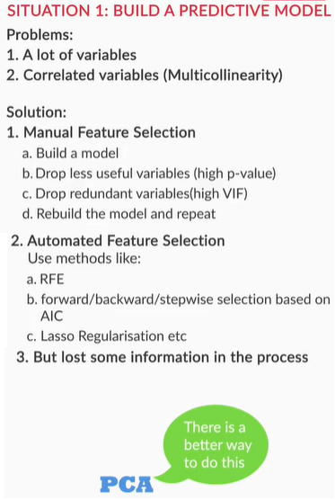

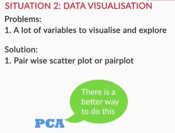

As explained, a couple of situations where having a lot of features posed problems for us are as follows:
* The predictive model setup: Having a lot of correlated features lead to the multicollinearity problem. Iteratively removing features is time-consuming and also leads to some information loss.
* Data visualisation: It is not possible to visualise more than two variables at the same time using any 2-D plot. Therefore, finding relationships between the observations in a data set having several variables through visualisation is quite difficult. 

Now, PCA helps in solving both the problems mentioned above which you'll study shortly.

### Applications of PCA
Fundamentally, PCA is a dimensionality reduction technique, i.e., it approximates the original data set to a smaller one containing fewer dimensions. To understand it visually, take a look at the following image.

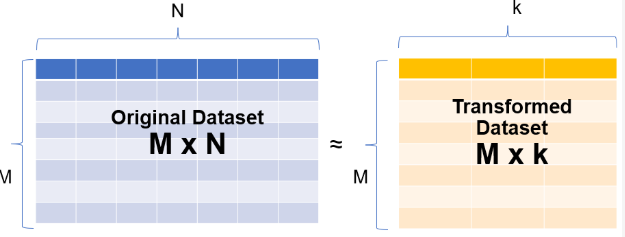

In the image above, you can see that a data set having N dimensions has been approximated to a smaller data set containing 'k' dimensions. In this module, you will learn how this manipulation is done. And this simple manipulation helps in several ways such as follows:
* For data visualisation and EDA
* For creating uncorrelated features that can be input to a prediction model:  With a smaller number of uncorrelated features, the modelling process is faster and more stable as well.
* Finding latent themes in the data: If you have a data set containing the ratings given to different movies by Netflix users, PCA would be able to find latent themes like genre and, consequently, the ratings that users give to a particular genre.
* Noise reduction

### The What of PCA
As discussed in the previous segment, PCA is fundamentally a dimensionality reduction technique; it helps in manipulating a data set to one with fewer variables. The following segment will give you a brief idea of what dimensionality reduction is and how PCA helps in achieving dimensionality reduction.

In simple terms, dimensionality reduction is the exercise of dropping the unnecessary variables, i.e., the ones that add no useful information. Now, this is something that you must have done in the previous modules. In EDA, you dropped columns that had a lot of nulls or duplicate values, and so on. In linear and logistic regression, you dropped columns based on their p-values and VIF scores in the feature elimination step.

Similarly, what PCA does is that it converts the data **by creating new features from old ones**, where it becomes easier to decide which features to consider and which not to. 

Now that you have an idea of the basics of what PCA does, let’s understand its definition in the following segment.

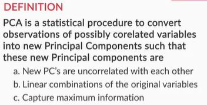

PCA is a statistical procedure to convert observations of possibly correlated variables to ‘principal components’ such that:
* They are **uncorrelated** with each other.
* They are **linear combinations** of the original variables.
* They help in capturing maximum **information** in the data set.

Now, the aforementioned definition introduces some new terms, such as **‘linear combinations’** and **‘capturing maximum information’**, for which you will need some knowledge of linear algebra concepts as well as other building blocks of PCA. In the next segment, we will start our journey in the same direction with the introduction of a very basic idea: the **vectorial representation of data**.

### Vectorial Representation of Data
In order to understand the workings of PCA, it is crucial to understand some essential linear algebra concepts, such as matrices, vectors and their associated operations. Let’s take a look at the following lecture as you go through a checklist of linear algebra stuff that you should be knowing before foraying into PCA.

To summarise what you're going to learn in this segment here's a handy checklist:
* Vectors and their properties
* Vector operations (addition, scaling, linear combination and dot product)
* Matrices 
* Matrix operations (matrix multiplication and matrix inverses

Let's start with understanding the dataset as a matrix of vectors in the following segment.

Consider the following data set containing the height and weight of five patients: 

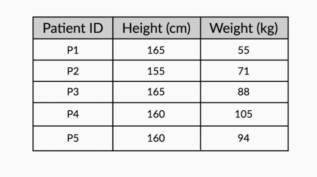

The height and weight information can be represented in the form of a matrix as follows

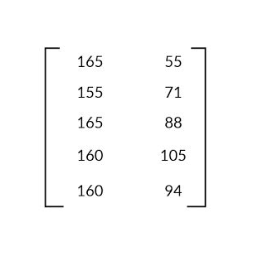

with each row representing a particular patient's data and each column representing the original variable. Geometrically, these patients can be represented as shown in the following image:

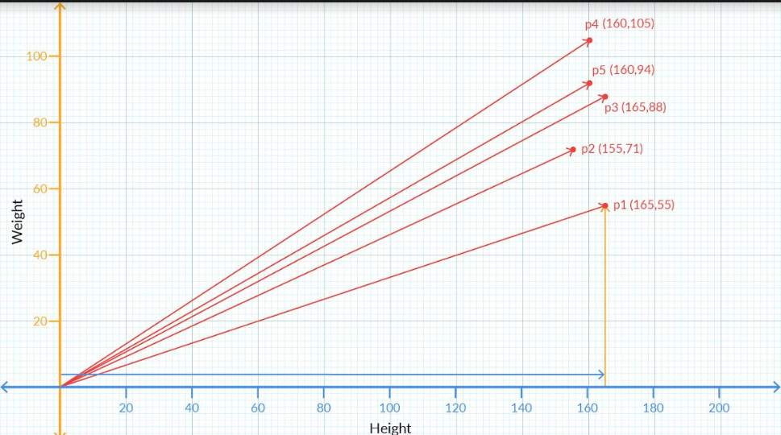

Vector Representation
The vector associated with the first patient is given by the values (165, 55). This value can also be written in the following way:

1. A column containing the values along the rows. This is also known as the column-vector representation.

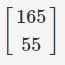

2. As a transpose of the above form. Essentially, it is the same column vector but now written as a transpose of a row vector.

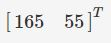

[Note: Transpose is something you must have learnt in your Python for DS  module. If you need some brushing up on this topic, you can take a look at this link (https://pandas.pydata.org/pandas-docs/stable/reference/api/pandas.DataFrame.transpose.html)]

3. In terms of the basis vectors  
This is something which you'll learn in detail in later segments. To give a brief idea, the vector (165,55) can also be written as 165**i** +55**j**, where **i** and **j** are the unit vectors along X and Y respectively and are the basis vectors used to represent all vectors in the 2-D space.

### Vector Representation for n-dimensional data
Each vector will contain values representing all the dimensions or variables in the data. For example, if there was an age variable also included in the above dataset and the first patient had an age of 22 years, then the vector representing him would be written as  (165, 55, 22). Similarly, if the dataset had 10 variables, there would be 10 dimensions in the vector representation. Similarly, you can extend it for n dimensions or variables.

Now, these vectors have certain properties and operations associated with them. Let's go ahead and learn them in the next segment.

### Vector Operations
Now that you've understood what vectors are, let's go ahead and learn about some vector properties and a few associated operations:

1. **Vectors have a direction and magnitude**
Each vector has a direction and magnitude associated with it. The direction is given by an arrow starting from the origin and pointing towards the vector's position. The magnitude is given by taking a sum of squares of all the coordinates of that vector and then taking its square root.

For example, the vector (2,3) has the direction given by the arrow joining (0,0) and (2,3) pointing towards (2,3). Its magnitude is given by

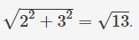

Similarly, for a vector in 3 dimensions, say (2,-3,4) its direction is given by the arrow joining (0,0,0) and (2,-3,4) pointing towards (2,-3,4). And as in the 2D case, we get the magnitude of this vector as

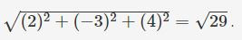

2. **Vector Addition**
When you add two or more vectors, we essentially add their corresponding values element-wise. The first element of both the vectors get added, the second element of the both get added and so on.

For example, if you've two vectors say 

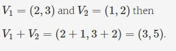

3. In the **i**, **j** notations that we introduced earlier, the above addition can be written as 

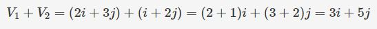

Similarly, this idea can be extended to multiple dimensions as well. 

4. **Scalar Multiplication**
If you multiply any real number or scalar by a vector, then there is a change in the magnitude of the vector and the direction remains same or turns completely opposite depending on whether the value is positive or negative respectively.

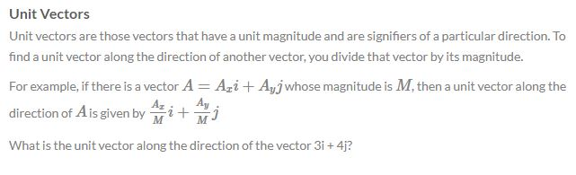

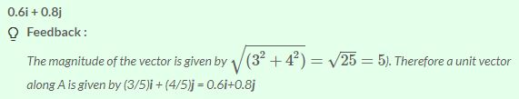

### Matrix Multiplication
Apart from the vector operations that we learnt previously, we need some knowledge of matrix operations as well.

The process of matrix multiplication is quite simple, and it involves the element-wise multiplication followed by addition of all the elements present in it. The one key rule that it must satisfy is when you multiply 2 matrices, say A and B, the number of columns of A must equal the number of rows in B. Visually, you can take a look at the following image to get the idea of how that should be:

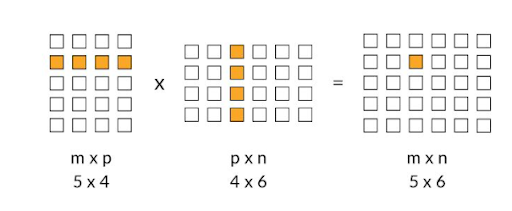

As shown in the example, since the number of columns in the first matrix and the number of rows in the second column are equal to 4, matrix multiplication is possible and the resultant matrix has a shape of 5 x 6.

The element-wise multiplication followed by addition is also pretty straightforward as can be seen in the following example:

[Matrix Multiplication in Python](dataset/MatrixMultiplication.ipynb)

### Inverse of a Matrix
To understand what the inverse of a matrix is, let's take a look at the following example:

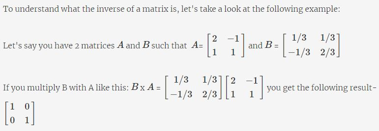

The matrix that you got after the multiplication above is also known as an **Identity matrix**. In matrix notation, it serves the same function as that of the number 1 in the real number system. To establish an analogy, in the real number system if you multiply any number by 1, you get the number itself. Similarly, when you multiply any matrix with the identity matrix, also denoted by I, you get the same matrix once again. ( You can calculate this and verify yourselves)

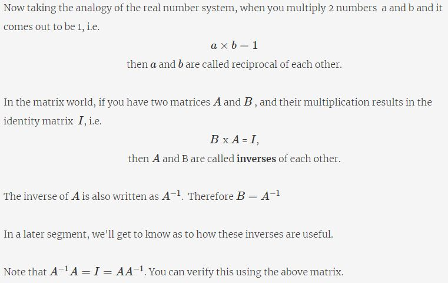

[Matrix Inverse in Python](dataset/MatrixInverse.ipynb)

#### Additional Reading
If you want to learn how to find the inverse of a Matrix mathematically, please refer to this link (https://www.khanacademy.org/math/algebra-home/alg-matrices/alg-intro-to-matrix-inverses/v/inverse-matrix-part-1).

### Basis
In the previous segments, you have learnt how to represent vectors and matrices and understood some of their important operations, we will dive into the first fundamental building block of PCA: Basis. But before we get into the math part of it, let’s understand, in a very intuitive way, what it represents, in the following segment.

Essentially, ‘basis’ is a unit in which we express the vectors of a matrix.

For example, we describe the weight of an object in terms of kilogram, gram and so on; to describe length, we use a metre, centimetre, etc. So for example, when you say that an object has a length of 23 cm, what you are essentially saying is that the object’s length is 23 × 1 cm. Here, 1 cm is the unit in which you are expressing the length of the object.

Similarly, vectors in any dimensional space or matrix can be represented as a linear combination of basis vectors.

Since i and j themselves represent **(1,0)** and **(0,1)**, you can represent any vector in the 2-D space with these i and j vectors.

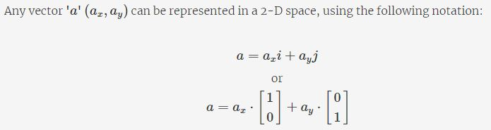

Visually, it can be represented as follows:

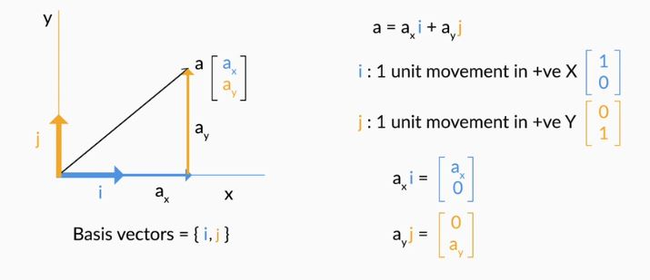

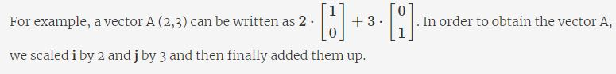

This scaling and adding the vectors up to obtain a new vector is also known as a **linear combination**. 

For the patients' dataset that we had earlier, we can denote each patient vector by the following notation:

Therefore, now we can say that Patient 1 is represented by 165(1 cm,0) + 55(0,1kg). And similarly, we can express other patients' information as well.

The **basic definition** of basis vectors is that they're a certain set of vectors whose linear combination is able to explain any other vector in that space. 

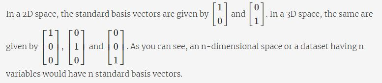

### Change of Basis: Introduction
In the previous segment, you understood the concept of basis vectors and how they're the most fundamental units through which you explain the vectors. Now, let's go ahead and understand how you can use different basis to explain the same set of vectors, similar to how you can use different units to explain the same measure.

Using the analogy of basis as a unit of representation, different basis vectors can be used to represent the same observations, just like you can represent the weight of a patient in kilograms or pounds. As in the previous case, the basis vectors for the representation of the patient’s information is given by

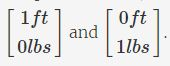

The following table summarises the results you get when you make the change.

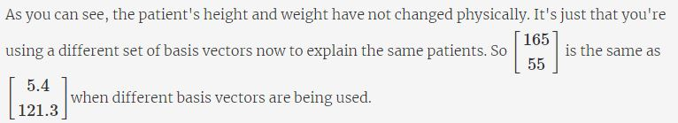

### Relationship between the two sets of  basis vectors
To understand the relationship between the two basis vectors in concrete terms, recall the way we introduced it in the previous segment. We said that every vector in the 2D space can be written as a linear combination of the basis vectors. 

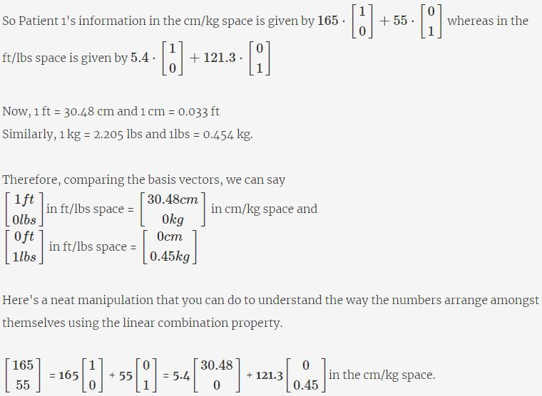

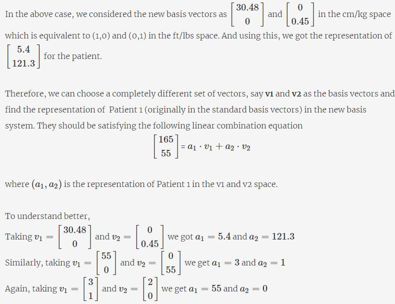

and so on..

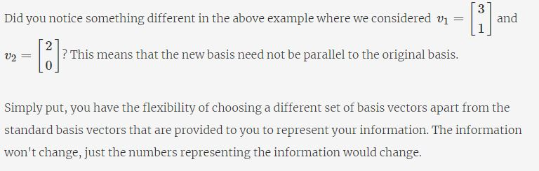

**Question**

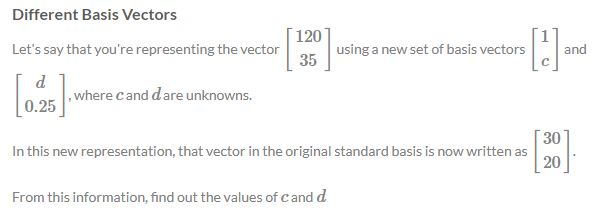

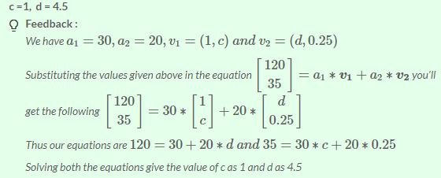

### Change of Basis: Demonstration
In the previous segments, you learnt the concept of basis and the change of basis. Now, you might wonder what role does it have to play in PCA. Let's understand how the change of basis plays an important role in the case of dimensionality reduction.

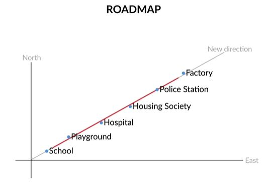

In above example instead of representing each place by two co-ordinates we can say that we just need to move in one direction say 2KM to reach playground from school. So we can say that we have reduce the dimensionality without loosing the information.

### Change of Basis: Calculations
In the previous segment, you saw a demonstration on how the change of basis led to dimensionality reduction. Let's go ahead and understand the an elegant way of doing the same calculations.

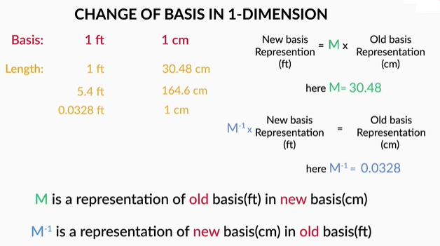

As you saw above, when you have one dimension, the calculations for the change of basis are pretty straightforward. All you need to do here is to multiply the factor M which gives you the method of transforming from one basis to another.

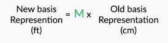

And to go in the opposite direction you simply have to divide by that factor M. Note that here M is a simple scalar since there is only one dimension involved.

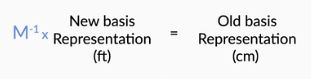

But when the transformation requires 2 or more dimensions, what to do then? Let's find out.

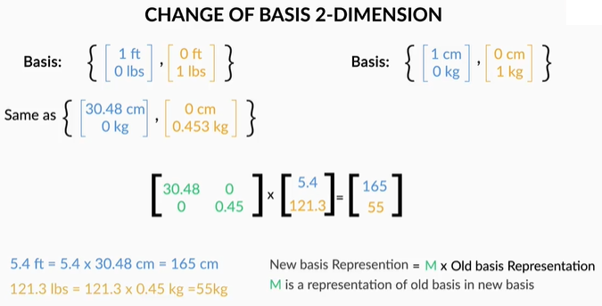

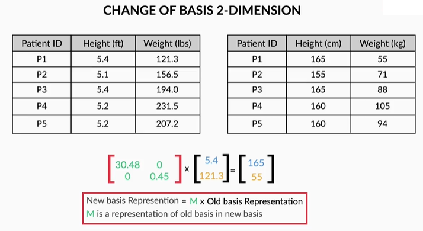

You saw that when more than one dimensions are involved, M becomes a matrix rather than a simple scalar. In this case, the first equation remains the same, just that here M is a matrix instead of a scalar. 

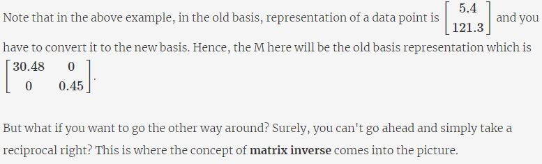

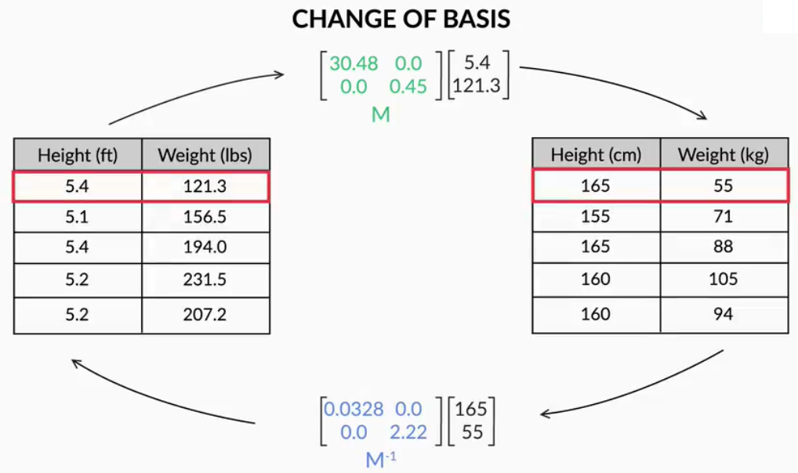

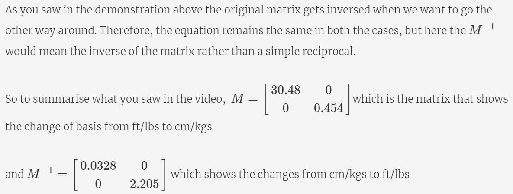

**Question**

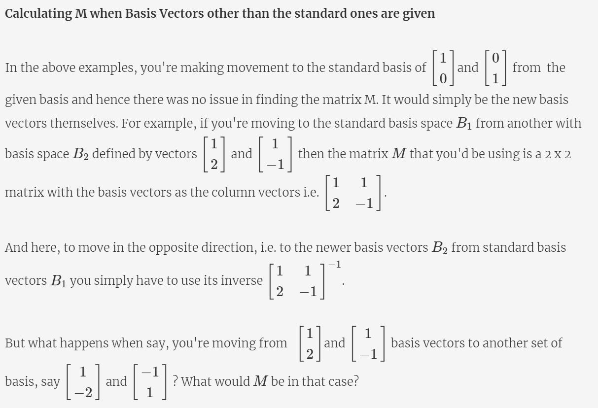

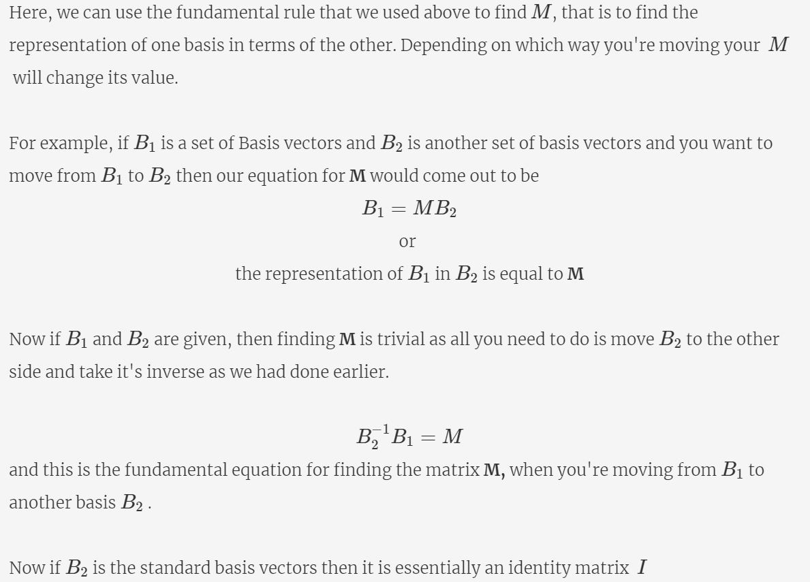

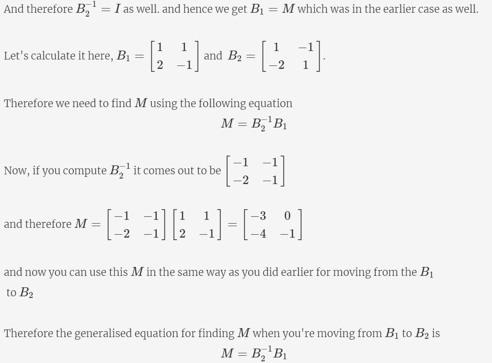

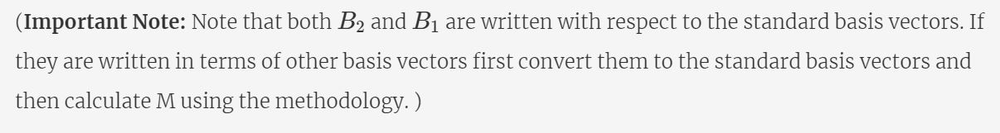

### Comprehension: I
In this segment, we will drive home the concept of Change in Basis. For this imagine you went to a different planet for exploratory reasons, to find intelligent life there. You met an alien there and you started showing it where you came from and location of Earth from that planet.

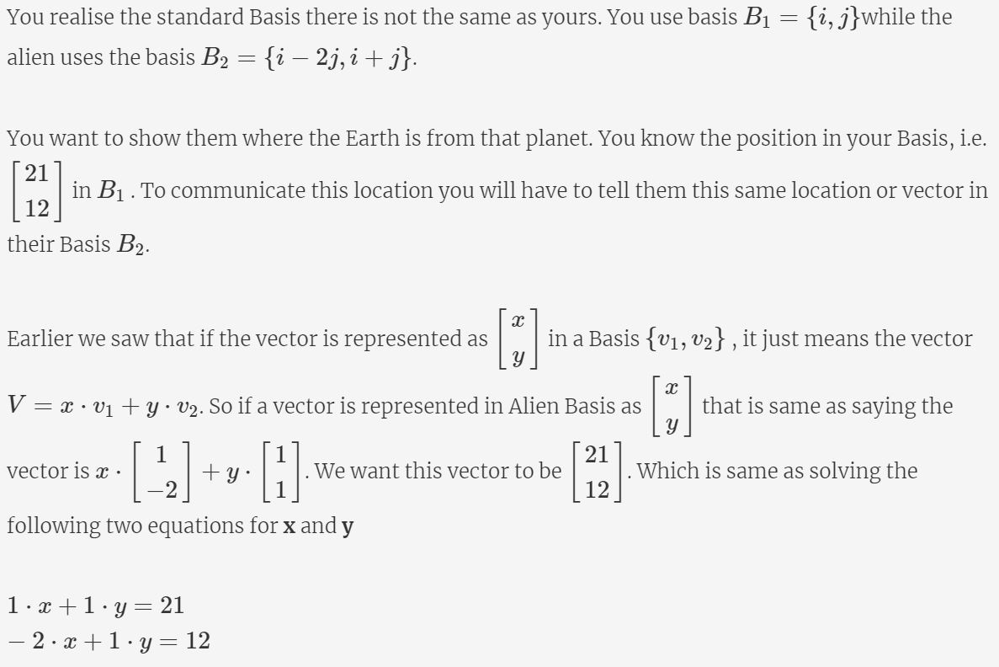

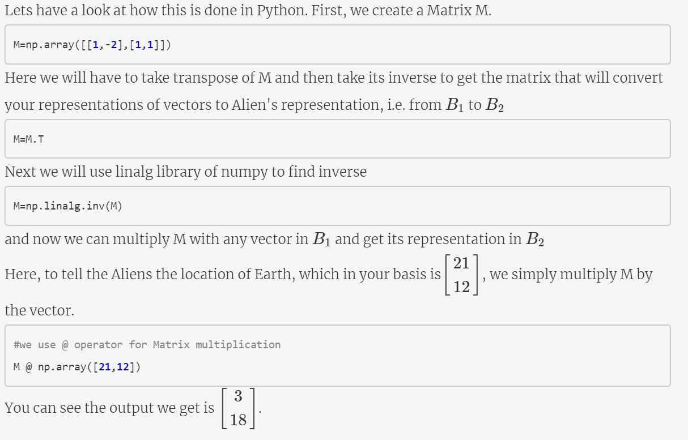

## Fundamentals of PCA: II

### Introduction to Variance
In the previous session, you learnt about the first fundamental building block for learning PCA - the idea of basis and the change of basis. You saw how a simple change of basis led to dimensionality reduction in the case of the roadmap example and then understood how you can represent the same data in multiple basis vectors.

However, we didn't know as to how to find those "ideal basis vectors" and what exact properties they must satisfy. In this session, we'll get to do that by understanding the idea of **variance as information**.

As mentioned previously, you have already learnt certain methods through which you delete columns – by checking the number of null values, unnecessary information and in modelling by checking the p-values and VIF scores.

PCA gauges the importance of a column by another metric called **‘variance’** or how varied a column’s values are.

Let's go ahead and look at some examples in the next segment and get an intuitive idea of what variance actually means.

### Variance as Information
Let's take a look at a simple example that will help us intuitively understand how variance in the data is equivalent to information we can extract out of the data.

As you saw in the example, the first image didn't have much information in it. Speaking of it in the ways the pixels are arranged, it is the same colour throughout. However, there is a lot of things that you could distinguish easily in the second image and therefore that image has a lot to offer in terms of information. The pixels have a lot of variety and therefore that image has more variance and equivalently, more information.

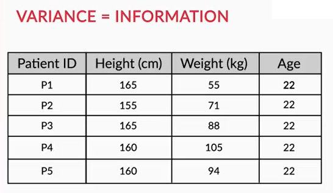

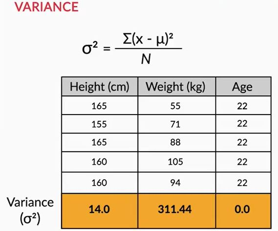

So the key takeaway from the above segment is to measure the importance of a column by checking its variance values. If a column has more variance, then this column will contain more information.

### Geometrically Interpretation of Variance
In the above example you saw that the variance of height was only 14, whereas that of weight was 311.14. This gave you an idea that Weight is a more important column than Height. Now, there is another elegant way of looking at variance geometrically. Take a look at the following image.

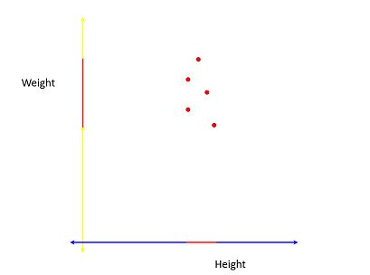

The red line on the Height and Weight axes show the **spread** of the projections of the vectors on those axes. As you can see here, the spread of the line is quite good on the Weight axis as compared to the Height axis. Hence you can say that Weight has more variance than Height. This idea of the spread of the data being equivalent to the variance is quite an elegant way to distinguish the important directions from the non-important ones.

### Directions of Maximum Variance
So you saw that when the variances are unequally distributed among the original features or columns i.e. some columns have much less variance than others, it is easier to remove those columns and do dimensionality reduction.

But what about the scenario when the variances are pretty similar? For example, take a look at the following image containing the height and weight information of a different group of patients.

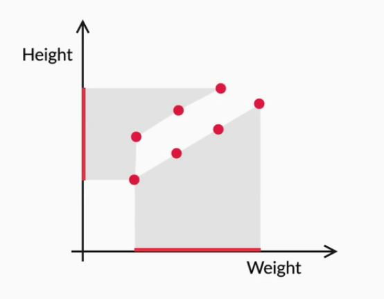

As you can see, the spread along both the axes is quite comparable and therefore, you can't directly go and say that one direction is more useful than the other. What to do now?

Let’s look at the next segment to further understand this problem and appreciate how smartly PCA solves this problem.

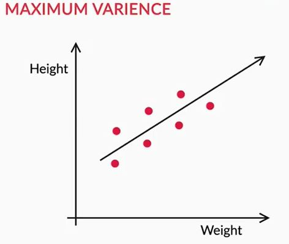

After going through the above segment, you have more or less understood what PCA does. It changes the basis vectors in such a way that the new basis vectors capture the maximum variance or information.

### The Workings of PCA
Until now, you've learnt the two building blocks of PCA: Basis and variance. In the following segment, we will make use of both the terms to make you understand the objective that PCA aims to achieve.

The ideal basis vectors that we wanted has the following properties:
* They explain the directions of maximum variance
* When used as the new set of basis vectors, the transformed dataset is now suitable for dimensionality reduction.
* These directions explaining the maximum variance are called the **Principal Components** of our data.

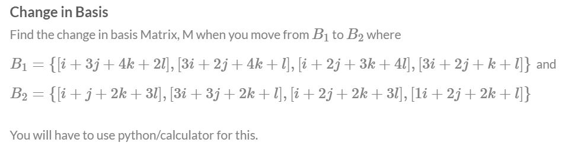

[Answer](dataset/answer.ipynb)

### The Algorithm of PCA
This session will introduce you to the following topics: 
* Covariance Matrix
* Eigendecomposition
* Algorithm of PCA

### Covariance Matrix
In the previous session, you learnt about how to find the variance of a particular column to measure its importance.  However, this does not capture the inter column relationship or the correlations between the variables. This information is essential since we also want to make sure that the multicollinearity in our dataset is minimum. In order to capture the covariance or the correlations between the columns, we use the covariance matrix. Let's look at the following segment to understand that.

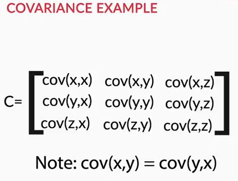

The covariance matrix is one such matrix that not only captures the variance but also the covariance information as well.

The covariance  between 2 columns X and Y is given by the following formula

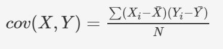

You need not calculate the values mathematically as there is a functionality in Python already available which shall be covered shortly. Nevertheless, you can check this link (https://corporatefinanceinstitute.com/resources/knowledge/finance/covariance/) to further understand how this value is calculated.

Here's a list of properties of the covariance matrix:

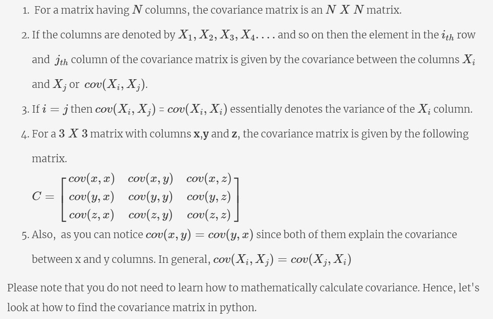

[Covariance in Python](dataset/Covariance.ipynb)

As mentioned earlier, the reason you study the covariance matrix is to capture all the information in the dataset - variance along the columns as well as the inter-column covariance. Now using this matrix, we'll be able to deduce the directions of maximum variance and we'll be learning how to do that in the upcoming segment.

### Transforming the Covariance Matrix
In the previous segment, you understood the structure of a covariance matrix and how it captures the intercolumnar variance. In this segment, you shall see how it plays a role in the algorithm of PCA. But first, let's go ahead and compute the covariance matrix in the following example.

So the given dataset A is as follows:

and the associated covariance matrix is given by 

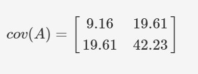

From here, we can observe that there is some correlation between the X and Y columns. Let's see what happens to the covariance matrix when we take another basis to represent the same points

#### Covariance Matrix in New Basis
Let's say that the same friend, who earlier gave you the smart suggestion in the roadmap example comes around again and asks you to represent your data in the following basis

He tells you that you'll observe something interesting with the covariance matrix when the data is represented in this basis. Let's check out your friend's claims.

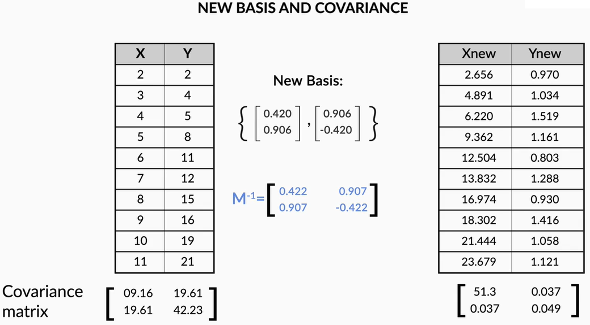

So as per your friend's suggestion, you went ahead and transformed the dataset and computed the covariance matrix for the new dataset A′. The new covariance matrix is as follows:

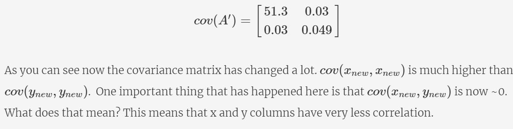

Well, now that the 2 features are **nearly uncorrelated**, there is no dependence or correlation of one direction on the other. This process of converting the covariance matrix with only non-zero diagonal elements and 0 values everywhere else is also known as **diagonalisation**.

### Creating Uncorrelated Features

Now you must be wondering "How does finding new basis vectors where the covariance matrix only has non-zero values along the diagonal and 0 elsewhere help us?"

Well now,

* Your new basis vectors are all uncorrelated and independent of each other.
* Since variance is now explained only by the new basis vectors themselves, you can find the directions of maximum variance by checking which value is higher than the rest numerically. There is no correlation to take into account this time. All the information in the dataset is explained by the columns themselves.

So now, your new basis vectors are **uncorrelated, hence linearly independent**, and **explain the directions of maximum variance**. 

As a matter of fact, these basis vectors are the **Principal Components** of the original matrix. The algorithm of PCA seeks to find those new basis vectors that diagonalise the covariance when the same data is represented on this new basis. And then these vectors would have all the above properties that we require and therefore would help us in the process of dimensionality reduction.

Let's now go ahead and learn about how PCA obtains these special vectors, in the next segment.

### Eigendecomposition
In the previous segment, you were already provided with the changed basis such that the non-diagonal elements in the covariance matrix had ~0 values. In other words, you somehow obtained the principal components and then observed that the covariance matrix has been diagonalized. But in real life, you need to find these components. Let's see how you find these principal components in the next segment.

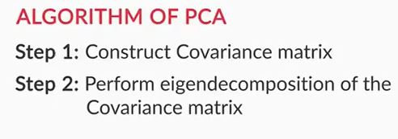

We need to do find something known as **eigenvectors** of the covariance matrix using a process called **Eigendecomposition**. These eigenvectors would be the new set of basis vectors in whose representation, the covariance matrix will be diagonalized. Therefore these would be the new principal components.

Here's a brief overview of what eigendecomposition is and how it is applied on the covariance matrix to give us the eigenvectors. Please note that though it is recommended that you understand the text below you can perform the eigendecomposition in a couple of steps in Python.

### An overview of Eigendecomposition
Basically, for any square matrix **A**, its **eigenvectors** are all the vectors **v** which satisfy the following equation:

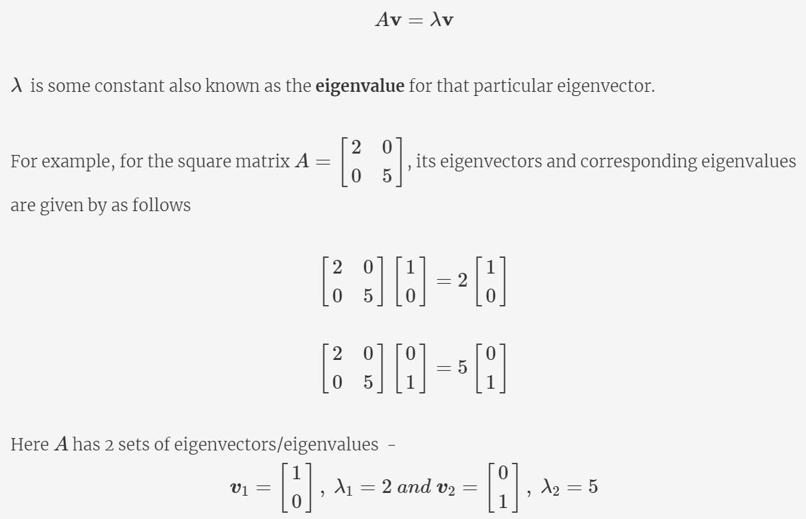

The process of finding the eigenvalues and eigenvectors of a matrix is known as eigendecomposition.
In general, if the size of matrix A is n ( i.e. it is a n x n matrix) then, there will be at most n eigenvectors that can be formed. As you saw in the above case, A is a 2 x 2 matrix and hence it had 2 eigenvectors.

Note: This is a brief overview of what eigenvectors and eigenvalues are and it is sufficient for you right now in the context of PCA. If you want to learn further about eigenvectors and how they're found out, please go through the additional link mentioned here (https://learn.upgrad.com/v/course/587/session/84815/segment/474213). 

### Eigendecomposition of Covariance Matrix
Now, continuing from the previous segment, we wanted to find a new set of basis vectors where the covariance matrix gets diagonalised. It turns out that these new set of basis vectors are in fact the eigenvectors of the Covariance Matrix. And therefore these eigenvectors are the Principal Components of our original dataset. In other words, these eigenvectors are the directions that capture maximum variance.

But what about the eigenvalues? What do they signify?

Well, the **eigenvalues** are indicators of **the variance explained by that particular direction** or eigenvector. So higher is the eigenvalue, higher is the variance explained by that eigenvector and hence that direction is more important for us.

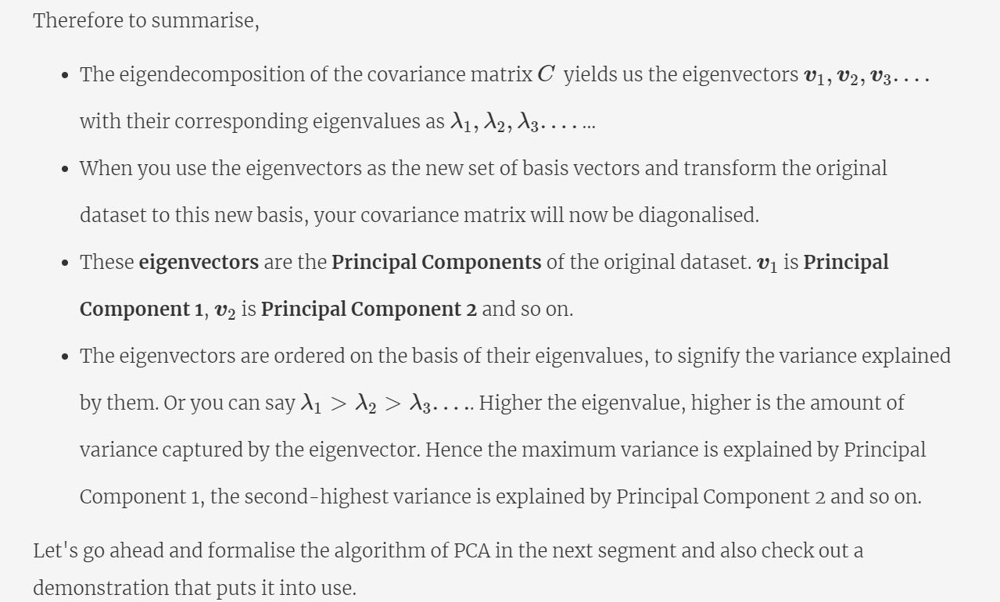

**Additional Links**

* Note that we haven't covered why doing an eigendecomposition on the covariance matrix yields us the Principal Components. This part is beyond the scope of the current module and therefore if you're curious about learning why this method works, you can take a look at this link (https://math.stackexchange.com/questions/23596/why-is-the-eigenvector-of-a-covariance-matrix-equal-to-a-principal-component).
* Apart from eigendecomposition, there are more generalised algorithms that are used to perform PCA right now such as the Singular Value Decomposition, about which you can read from this link (https://medium.com/data-science-group-iitr/singular-value-decomposition-elucidated-e97005fb82fa).

### Algorithm of PCA
In the previous segments, you saw that you first calculate the covariance of columns of the dataset and then calculate the eigenvectors of the covariance matrix which acts as the basis of the new representation. Having this understanding, let's first summarize this process of PCA and then subsequently take a look at a Demonstration to concretize our understanding.

So formally, you now understand what the algorithm of PCA does. Here's a flowchart that summarises the important steps.

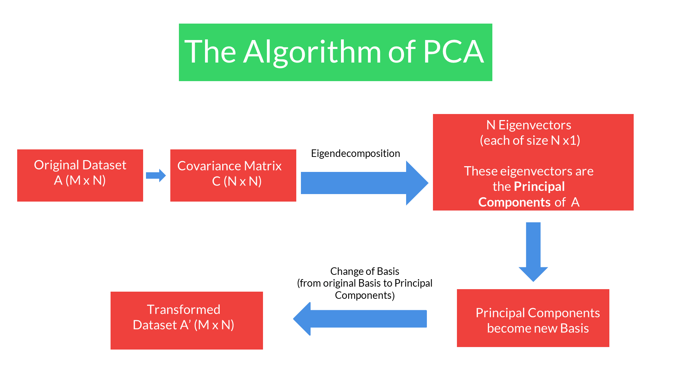

### Demonstration
Here's a short demonstration that shows how these directions are found. We'll be using the same roadmap example that you saw earlier. Earlier your friend found the new directions visually, without any additional computations. Let's see how PCA does the same using the algorithm that you just saw above.

Here we've the coordinates of the various locations in the original basis as shown in the image below:

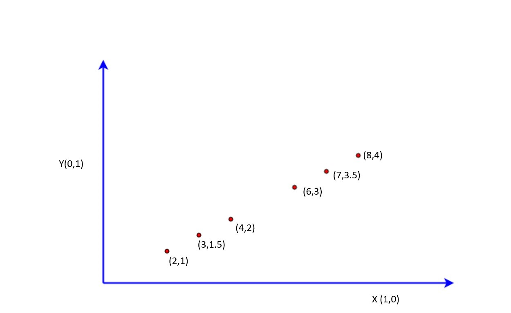

Let's write the datapoints in matrix form now:

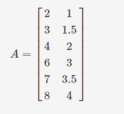

Now let's go ahead and perform the steps of the PCA algorithm on this dataset.

* Step 1: Finding the covariance matrix 
  
  First, we need to compute the covariance matrix of A. This comes out to be the following.(You can use numpy.cov to find the covariance matrix as well)
 
  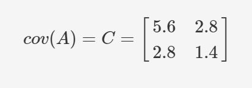

* Step 2: Eigendecomposition of the covariance matrix

Next, we need to find the eigenvectors of the covariance matrix C which would be the Principal Components of the original dataset A. They come out to be the following:
(You can use the np.linalg.eig function to compute them)

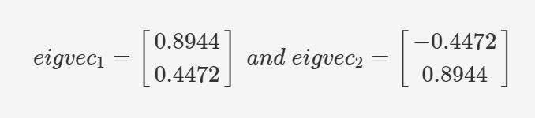

These eigenvectors form the new set of basis vectors.The eigenvectors represent the new set of basis vectors or directions along which the points need to be represented now. The new directions can be visualised below along the green lines:

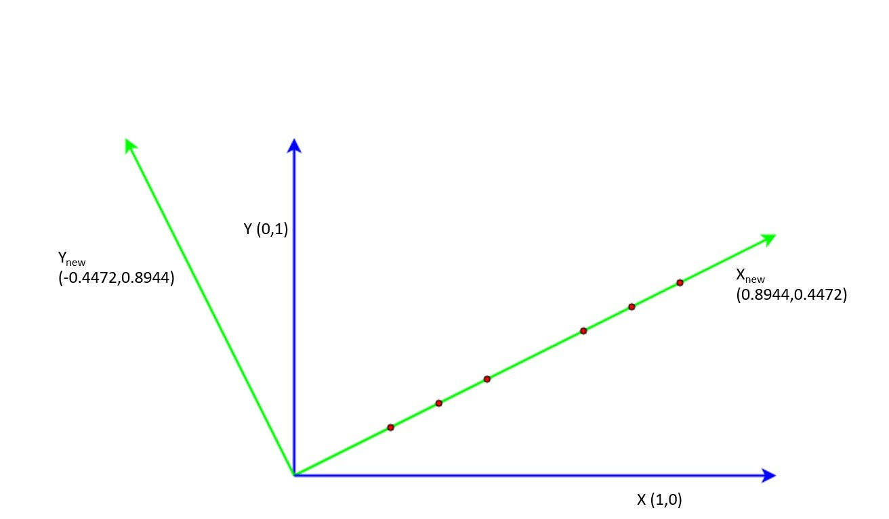

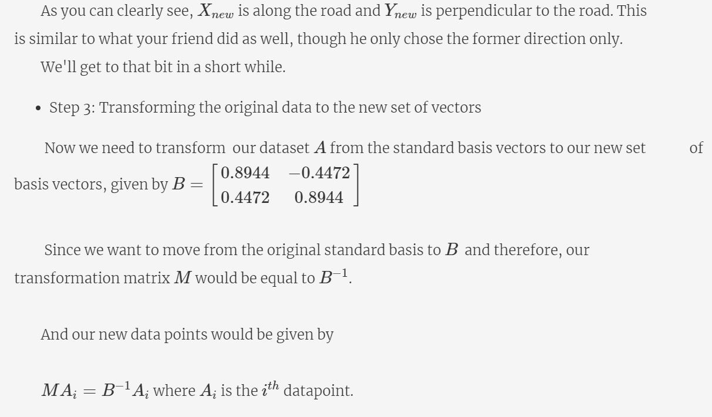

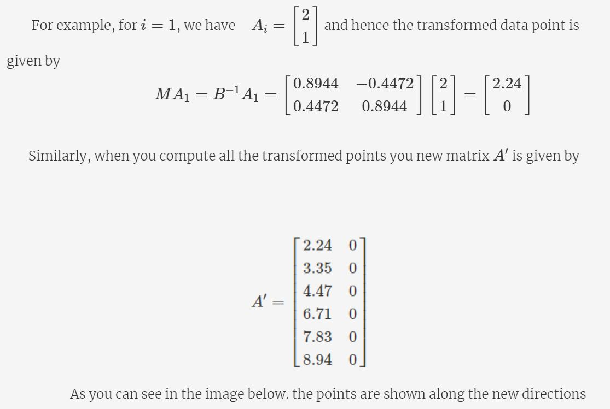

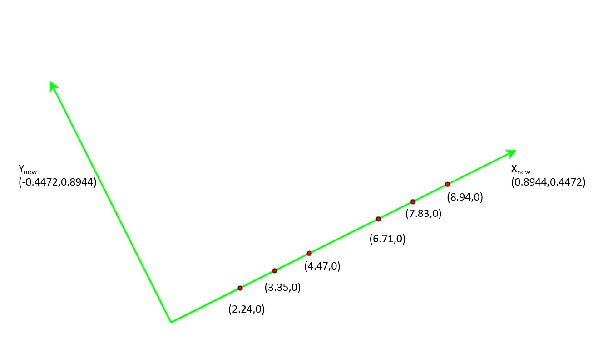

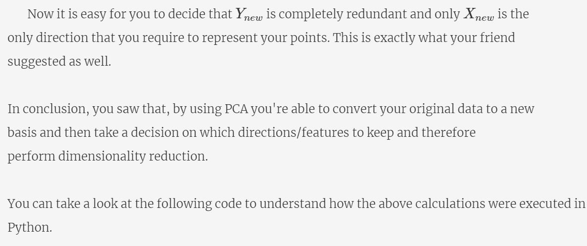

[Demonstration:Algorithm of PCA](dataset/Algorithm+of+PCA+Demonstration.ipynb)

### PCA in Python

### Introduction
Welcome to the fourth session of PCA. In the previous session, you discovered and learnt the theoretical concepts of PCA. In this session, you will learn how to implement PCA in python on some real examples.

In this session, you will learn how to use PCA on a problem you have already encountered before - predicting telecom churn using logistic regression. You will now learn to implement PCA in tandem with logistic regression.

### Applying PCA using Python
For this demonstration, we begin with a very popular machine learning dataset - 'Iris'. In the next few segments, you will learn the necessary steps needed to perform PCA on a dataset and then appreciate how it helps in visualising your data that contains more than two dimensions.

You can download the dataset and the python notebook used in the demonstration from the link given below:

[Iris Dataset](dataset/Iris.csv)

[PCA Demo Iris](dataset/PCADemoIris.ipynb)

Here is a summary of the important steps that you've performed and something that you should do whenever you perform PCA on any other dataset as well.

1. After basic data cleaning procedures, standardise your data
2. Once standardisation has been done, you can go ahead and perform PCA on the dataset. For doing this you import the necessary libraries from sklearn.decomposition.

3. Instantiate the PCA function and set the random state to some specific number so that you get the same result every time you execute that code. (If you want to learn more about random state and how it works, you can check this StackOverflow answer (https://stackoverflow.com/questions/42191717/python-random-state-in-splitting-dataset/42197534#42197534))

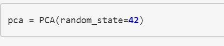

4.  Perform PCA on the dataset by using the pca.fit function. 

The above function does both the steps: **finding the covariance matrix and doing an eigendecomposition of it to obtain the eigenvectors**, which are nothing but the **Principal Components** of the original dataset.

5. The Principal Components can be accessed using the following code

Executing the above code will give the list of Principal components of the original dataset. They'll be of the same number as the original variables in your dataset. In the next segment, you shall see how to choose the optimal number of principal components.

### Scree Plots
In the previous segment, you learnt how to perform PCA on your dataset and obtain the Principal Components. The final PCs that you got were as follows:

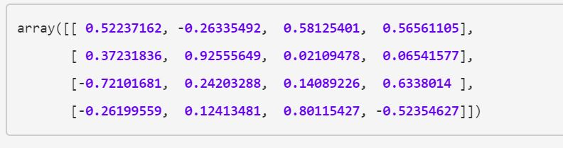

PC1 is given by the direction - [0.52  -0.26  0.58   0.56], PC2 by  [0.37 0.92 0.02 0.06] and so on. The principal components of the same number as that of the original variables with each Principal Component explaining some amount of variance of the entire dataset. This information would enable us to know which Principal Components to keep and which to discard to perform Dimensionality Reduction. 

Let's understand it further in the following demonstration, where you'll also come to know about **scree plots** and how they help in communicating the variance information very effectively.

Here's a summary of the important steps that you performed 

1. First, you came to know how much variance is being explained by each Principal Component using the following code

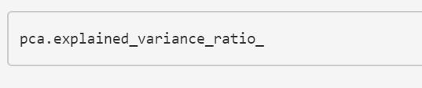

The values that you got were as follows

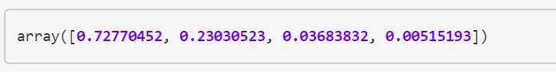

The above values can be summarised in the following table

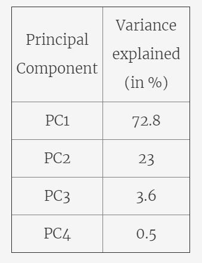

So as you can see, the first PC, i.e. Principal Component 1([0.52  -0.26  0.58   0.56]) explains the maximum information in the dataset followed by PC2 at 23% and PC3 at 3.6%. In general, when you perform PCA, all the Principal Components are formed in decreasing order of the information that they explain. Therefore, the first principal component will always explain the highest variance, followed by the second principal component and so on. This order helps us in our dimensionality reduction exercise, as now we know which directions are more important than the others. 

Now, in our dataset, we only had 4 columns and equivalently 4 PCs. Therefore it was easy to visualise the amount of variance explained by them using a simple bar plot and then we're able to make a call as to how much variance to keep in the data. For example, using the table above, you only need 2 principal components or 2 directions (PC1 and PC2) to explain more than 95% of the variation in the data.

But what happens when there are hundreds of columns? Using the above process would be cumbersome since you'd need to look at all the PCs and keep adding their variances up to find the total variance captured.

2. Using a **Scree-Plot**
An elegant solution here would be to simply add plot a "Cumulative variance explained chart" Here against each number of components, we have the total variance explained by all the components till then.

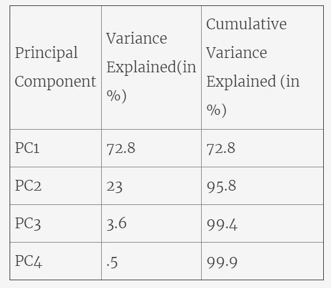

So for example, cumulative variance explained by the top 2 principal components is the sum of their individual variances, given by 72.8 +23 =95.8 %. Similarly, you can continue this for 3 and 4 components.

If you plot the number of components on the X-axis and the total variance explained on the Y-axis, the resultant plot is also known as a Scree-Plot. It would look somewhat like this:

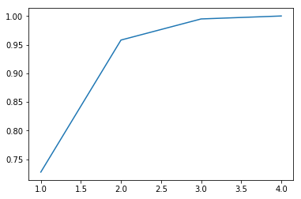

Now, this is a better representation of variance and the number of components needed to explain that much variance. 

### Dimensionality Reduction
In the previous two segments, you understood how to apply PCA on a dataset followed by the importance of scree-plots. Now that you know how many principal components you need to explain a certain amount of variance, let's go and finally do dimensionality reduction on our dataset using the Principal Components that we've chosen.

Here's a summary of the important steps that you saw above:

1. Choosing the required number of components

From the scree plot that you saw previously, you decided to keep ~95% of the information in the data that we have and for that, you need only 2 components. Hence you instantiate a new PCA function with the number of components as 2. This function will perform the dimensionality reduction on our dataset and reduce the number of columns from 4 to 2.

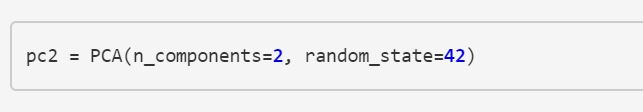

2. Perform Dimensionality Reduction on our dataset.
Now you simply transform the original dataset to the new one where the columns are given by the Principal Components. Here you've finally performed the dimensionality reduction on the dataset by reducing the number of columns from 4 to 2 and still retain 95% of the information. The code that you used to perform the same step is as follows:

and the new dataset is given as follows:

3. Data Visualisation using the PCs
Now that you have got the data in 2 dimensions, it is easier for you to visualise the same using a scatterplot or some other chart. By plotting the observations that we have and dividing them on the basis of the species that they belong to we got the following chart:

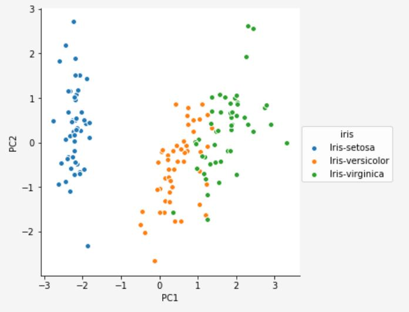

As you can see, you clearly see that all the species are well segregated from each other and there is little overlap between them. This is quite good as such insight was not possible with higher dimensions as you won't be able to plot them on a 2-D surface. So, therefore, applying  PCA on our data is quite beneficial for observing the relationship between the data points quite elegantly.

**Important Note**: When you perform PCA on datasets generally, you may need more than 2 components to explain an adequate amount of variance in the data. In those cases, if you want to visualise the relationship between the observations, choose the top 2 Principal Components as your X and Y axes to plot a scatterplot or any such plot to do the same. Since PC1 and PC2 explain the most variance in the dataset, you'll be getting a good representation of the data when you visualise your dataset on those 2 columns.

### Improving Model Performance - I
In the previous segments, you saw how to perform dimensionality reduction using PCA and then immediately were introduced to one of its key applications which is for data visualisation. However, the most common application of PCA is to improve your model's performance. So in real life, you use PCA in conjunction with any other model like Linear Regression, Logistic Regression, Clustering amongst others in order to make the process more efficient. In the following demonstration, you'll be looking at both the scenarios - performing model building without PCA and then with PCA to appreciate how much faster it is to get similar or better results in the latter case.

Download the datasets and the python notebook for this demonstration from the link given below:

[Model Building with PCA](dataset/LogisticRegression-TelecomChurnwithPCA.ipynb)

**Overview of the Demo**

For this demonstration, our main model will be a logistic regression setup. As mentioned above, first we'll be performing Logistic Regression directly without any PCA. For this demo, we'll be using the Telecom Churn dataset that you have worked earlier with.

**Model Building without PCA**

Since you're already familiar with the data and the logistic regression model that you built, here's a quick walkthrough to refresh your memory.

You saw the process of building a churn prediction model using logistic regression. Some important problems with this process that are pointed out are:
* **Multicollinearity** among a large number of variables, which is not totally avoided even after reducing variables using RFE (or a similar technique)
Need to use a **lengthy iterative procedure**, i.e. identifying collinear variables, using variable selection techniques, dropping insignificant ones etc.
A **potential loss of information** due to dropping variables
**Model instability** due to 

If you remember the first session, we discussed all these points as potential issues that plague our model building activity. Now let's go ahead and perform PCA on the dataset and then apply Logistic Regression and see if we get any better results

**Model Building with PCA**
In the second part, first, we'll reduce the dimensions that we have using PCA and then create a logistic regression model on it.

As you could see, with PCA, you could achieve the same results with just a couple of lines of code. It will be helpful to note that the baseline PCA model has performed at par with the best Logistic Regression model built after the feature elimination and other steps.

PCA helped us solve the problem of multicollinearity (and thus model instability), loss of information due to the dropping of variables, and we don't need to use iterative feature selection procedures. Also,  our model becomes much faster because it has to run on a smaller dataset. And even then, our ROC score, which is a key model performance metric is similar to what we achieved previously.

To sum it up, if you're doing any sort of modelling activity on a large dataset containing lots of variables, it is a good practice to perform PCA on that dataset first, reduce the dimensionality and then go ahead and create the model that you wanted to make in the first place. You are advised to perform PCA on the datasets that you worked on in Linear Regression and Clustering as well, to see how it makes our job easier.

### Improving Model Performance - II
Till now, you've been looking at the scree-plot to choose the number of components that explain a certain amount of variance before going for the dimensionality reduction using PCA. Now, there is a nice functionality which makes this process even more unsupervised. All you need to do is select the amount of variance that you want your final dataset to capture and PCA does the rest for you. Let's take a look at the following demonstration to see how we can do the same.

As you saw above, all you needed to do was select a particular amount of variance that you want to be explained by the Principal Components of the transformed dataset. PCA automatically chooses the appropriate number of components on its own and proceeds with the transformation. This again saves us a lot of time!

### Practical Considerations and Alternatives
Until now, you know the in and out of PCA and how to implement in Python and hence, you should be aware when to apply PCA. Let's now look at some practical considerations that need to be kept in mind while applying PCA.

Those were some important points to remember while using PCA. To summarise:

* Most software packages use SVD to compute the principal components and assume that the data is **scaled and centred**, so it is important to do standardisation/normalisation.
* PCA is a **linear transformation method** and works well in tandem with linear models such as linear regression, logistic regression etc., though it can be used for computational efficiency with non-linear models as well.
It should **not be used forcefully to reduce dimensionality** (when the features are not correlated).

You learnt some important shortcomings of PCA:

* PCA is limited to linearity, though we can use **non-linear techniques such as t-SNE** as well (you can read more about t-SNE in the optional reading material below).
* PCA needs the components to be perpendicular, though in some cases, that may not be the best solution. The alternative technique is to use **Independent Components Analysis**. 
* PCA assumes that columns with low variance are not useful, which might not be true in prediction setups (especially classification problem with a high class imbalance).

If you are interested in reading about t-SNE (t-Distributed Stochastic Neighbor Embedding) or ICA, you can go through the additional reading provided below.

**Additional Reading** 
**t-SNE**
* Laurens van der Maaten's (creator of t-SNE) website (https://lvdmaaten.github.io/tsne/)
* Visualising data using t-SNE: Journal of Machine Learning Research (https://www.jmlr.org/papers/volume9/vandermaaten08a/vandermaaten08a.pdf)
* How to use t-SNE effectively(https://distill.pub/2016/misread-tsne/)

**Independent Components Analysis**  
* Stanford notes on ICA(http://cs229.stanford.edu/notes/cs229-notes11.pdf)