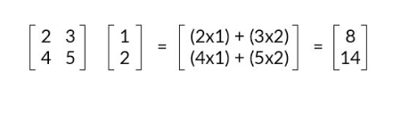
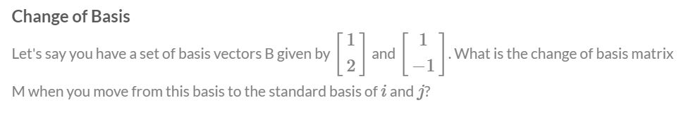
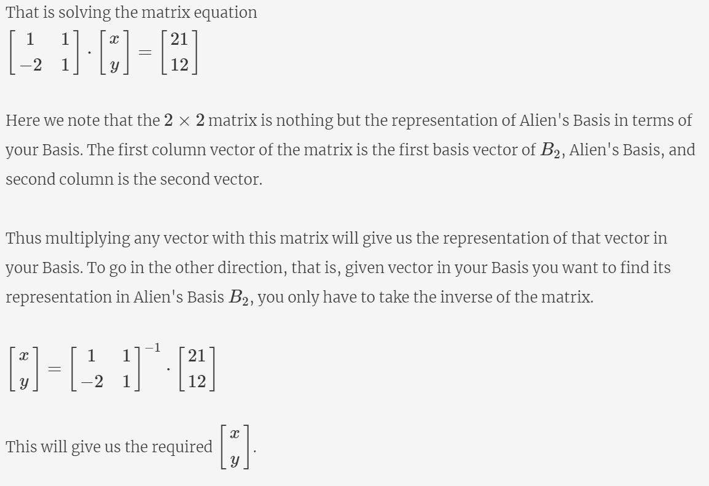

# Unsupervised Learning: Principal Component Analysis

## Fundamentals of PCA: I

### Introduction
Welcome to the module on ‘Principal Component Analysis’. 

**Principal component analysis (PCA)** is one of the most commonly used dimensionality reduction techniques in the industry. By converting large data sets into smaller ones containing fewer variables, it helps in improving model performance, visualising complex data sets, and in many more areas.

The  entire module has been divided into the following sections:
* **Fundamentals of PCA**: Here, you will get an idea of why you should learn about PCA and its essential building blocks before understanding the process.
* **Algorithm of PCA**: In this session, we will discuss the nuts and bolts of how PCA works.
* **PCA Using Python**:  Here, you will implement PCA using Python and get to know its various applications.

Prerequisites
This module requires prior knowledge of certain linear algebra concepts, such as matrices, vectors, etc. You will get to know about those prerequisites, along with a brief overview of each, as you go through the sessions. You can also learn the same from the additional module on ‘Maths for Data Analysis’ (https://learn.upgrad.com/v/course/587/session/84813/segment/474202), which contains some useful additional content and questions to improve your understanding of these concepts. Here is a checklist of the concepts that you need to know to understand this module:

* Vectors and their properties
* Vector operations (addition, scaling, linear combination and dot product)
* Matrices 
* Matrix operations (matrix multiplication and matrix inverses

### The Why of PCA
The first thing to know before learning anything new is to understand why and how that knowledge is useful. Hence, let's start by understanding the motivation for studying PCA and then look at a brief overview of the technique and its applications.

As explained, a couple of situations where having a lot of features posed problems for us are as follows:
* The predictive model setup: Having a lot of correlated features lead to the multicollinearity problem. Iteratively removing features is time-consuming and also leads to some information loss.
* Data visualisation: It is not possible to visualise more than two variables at the same time using any 2-D plot. Therefore, finding relationships between the observations in a data set having several variables through visualisation is quite difficult. 

Now, PCA helps in solving both the problems mentioned above which you'll study shortly.

### Applications of PCA
Fundamentally, PCA is a dimensionality reduction technique, i.e., it approximates the original data set to a smaller one containing fewer dimensions. To understand it visually, take a look at the following image.

In the image above, you can see that a data set having N dimensions has been approximated to a smaller data set containing 'k' dimensions. In this module, you will learn how this manipulation is done. And this simple manipulation helps in several ways such as follows:
* For data visualisation and EDA
* For creating uncorrelated features that can be input to a prediction model:  With a smaller number of uncorrelated features, the modelling process is faster and more stable as well.
* Finding latent themes in the data: If you have a data set containing the ratings given to different movies by Netflix users, PCA would be able to find latent themes like genre and, consequently, the ratings that users give to a particular genre.
* Noise reduction

### The What of PCA
As discussed in the previous segment, PCA is fundamentally a dimensionality reduction technique; it helps in manipulating a data set to one with fewer variables. The following segment will give you a brief idea of what dimensionality reduction is and how PCA helps in achieving dimensionality reduction.

In simple terms, dimensionality reduction is the exercise of dropping the unnecessary variables, i.e., the ones that add no useful information. Now, this is something that you must have done in the previous modules. In EDA, you dropped columns that had a lot of nulls or duplicate values, and so on. In linear and logistic regression, you dropped columns based on their p-values and VIF scores in the feature elimination step.

Similarly, what PCA does is that it converts the data **by creating new features from old ones**, where it becomes easier to decide which features to consider and which not to. 

Now that you have an idea of the basics of what PCA does, let’s understand its definition in the following segment.

PCA is a statistical procedure to convert observations of possibly correlated variables to ‘principal components’ such that:
* They are **uncorrelated** with each other.
* They are **linear combinations** of the original variables.
* They help in capturing maximum **information** in the data set.

Now, the aforementioned definition introduces some new terms, such as **‘linear combinations’** and **‘capturing maximum information’**, for which you will need some knowledge of linear algebra concepts as well as other building blocks of PCA. In the next segment, we will start our journey in the same direction with the introduction of a very basic idea: the **vectorial representation of data**.

### Vectorial Representation of Data
In order to understand the workings of PCA, it is crucial to understand some essential linear algebra concepts, such as matrices, vectors and their associated operations. Let’s take a look at the following lecture as you go through a checklist of linear algebra stuff that you should be knowing before foraying into PCA.

To summarise what you're going to learn in this segment here's a handy checklist:
* Vectors and their properties
* Vector operations (addition, scaling, linear combination and dot product)
* Matrices 
* Matrix operations (matrix multiplication and matrix inverses

Let's start with understanding the dataset as a matrix of vectors in the following segment.

Consider the following data set containing the height and weight of five patients: 

The height and weight information can be represented in the form of a matrix as follows

with each row representing a particular patient's data and each column representing the original variable. Geometrically, these patients can be represented as shown in the following image:

Vector Representation
The vector associated with the first patient is given by the values (165, 55). This value can also be written in the following way:

1. A column containing the values along the rows. This is also known as the column-vector representation.

2. As a transpose of the above form. Essentially, it is the same column vector but now written as a transpose of a row vector.

[Note: Transpose is something you must have learnt in your Python for DS  module. If you need some brushing up on this topic, you can take a look at this link (https://pandas.pydata.org/pandas-docs/stable/reference/api/pandas.DataFrame.transpose.html)]

3. In terms of the basis vectors  
This is something which you'll learn in detail in later segments. To give a brief idea, the vector (165,55) can also be written as 165**i** +55**j**, where **i** and **j** are the unit vectors along X and Y respectively and are the basis vectors used to represent all vectors in the 2-D space.

### Vector Representation for n-dimensional data
Each vector will contain values representing all the dimensions or variables in the data. For example, if there was an age variable also included in the above dataset and the first patient had an age of 22 years, then the vector representing him would be written as  (165, 55, 22). Similarly, if the dataset had 10 variables, there would be 10 dimensions in the vector representation. Similarly, you can extend it for n dimensions or variables.

Now, these vectors have certain properties and operations associated with them. Let's go ahead and learn them in the next segment.

### Vector Operations
Now that you've understood what vectors are, let's go ahead and learn about some vector properties and a few associated operations:

1. **Vectors have a direction and magnitude**
Each vector has a direction and magnitude associated with it. The direction is given by an arrow starting from the origin and pointing towards the vector's position. The magnitude is given by taking a sum of squares of all the coordinates of that vector and then taking its square root.

For example, the vector (2,3) has the direction given by the arrow joining (0,0) and (2,3) pointing towards (2,3). Its magnitude is given by

Similarly, for a vector in 3 dimensions, say (2,-3,4) its direction is given by the arrow joining (0,0,0) and (2,-3,4) pointing towards (2,-3,4). And as in the 2D case, we get the magnitude of this vector as

2. **Vector Addition**
When you add two or more vectors, we essentially add their corresponding values element-wise. The first element of both the vectors get added, the second element of the both get added and so on.

For example, if you've two vectors say 

3. In the **i**, **j** notations that we introduced earlier, the above addition can be written as 

Similarly, this idea can be extended to multiple dimensions as well. 

4. **Scalar Multiplication**
If you multiply any real number or scalar by a vector, then there is a change in the magnitude of the vector and the direction remains same or turns completely opposite depending on whether the value is positive or negative respectively.

### Matrix Multiplication
Apart from the vector operations that we learnt previously, we need some knowledge of matrix operations as well.

The process of matrix multiplication is quite simple, and it involves the element-wise multiplication followed by addition of all the elements present in it. The one key rule that it must satisfy is when you multiply 2 matrices, say A and B, the number of columns of A must equal the number of rows in B. Visually, you can take a look at the following image to get the idea of how that should be:

As shown in the example, since the number of columns in the first matrix and the number of rows in the second column are equal to 4, matrix multiplication is possible and the resultant matrix has a shape of 5 x 6.

The element-wise multiplication followed by addition is also pretty straightforward as can be seen in the following example:

[Matrix Multiplication in Python](dataset/MatrixMultiplication.ipynb)

### Inverse of a Matrix
To understand what the inverse of a matrix is, let's take a look at the following example:

The matrix that you got after the multiplication above is also known as an **Identity matrix**. In matrix notation, it serves the same function as that of the number 1 in the real number system. To establish an analogy, in the real number system if you multiply any number by 1, you get the number itself. Similarly, when you multiply any matrix with the identity matrix, also denoted by I, you get the same matrix once again. ( You can calculate this and verify yourselves)

[Matrix Inverse in Python](dataset/MatrixInverse.ipynb)

#### Additional Reading
If you want to learn how to find the inverse of a Matrix mathematically, please refer to this link (https://www.khanacademy.org/math/algebra-home/alg-matrices/alg-intro-to-matrix-inverses/v/inverse-matrix-part-1).

### Basis
In the previous segments, you have learnt how to represent vectors and matrices and understood some of their important operations, we will dive into the first fundamental building block of PCA: Basis. But before we get into the math part of it, let’s understand, in a very intuitive way, what it represents, in the following segment.

Essentially, ‘basis’ is a unit in which we express the vectors of a matrix.

For example, we describe the weight of an object in terms of kilogram, gram and so on; to describe length, we use a metre, centimetre, etc. So for example, when you say that an object has a length of 23 cm, what you are essentially saying is that the object’s length is 23 × 1 cm. Here, 1 cm is the unit in which you are expressing the length of the object.

Similarly, vectors in any dimensional space or matrix can be represented as a linear combination of basis vectors.

Since i and j themselves represent **(1,0)** and **(0,1)**, you can represent any vector in the 2-D space with these i and j vectors.

Visually, it can be represented as follows:

This scaling and adding the vectors up to obtain a new vector is also known as a **linear combination**. 

For the patients' dataset that we had earlier, we can denote each patient vector by the following notation:

Therefore, now we can say that Patient 1 is represented by 165(1 cm,0) + 55(0,1kg). And similarly, we can express other patients' information as well.

The **basic definition** of basis vectors is that they're a certain set of vectors whose linear combination is able to explain any other vector in that space. 

### Change of Basis: Introduction
In the previous segment, you understood the concept of basis vectors and how they're the most fundamental units through which you explain the vectors. Now, let's go ahead and understand how you can use different basis to explain the same set of vectors, similar to how you can use different units to explain the same measure.

Using the analogy of basis as a unit of representation, different basis vectors can be used to represent the same observations, just like you can represent the weight of a patient in kilograms or pounds. As in the previous case, the basis vectors for the representation of the patient’s information is given by

The following table summarises the results you get when you make the change.

### Relationship between the two sets of  basis vectors
To understand the relationship between the two basis vectors in concrete terms, recall the way we introduced it in the previous segment. We said that every vector in the 2D space can be written as a linear combination of the basis vectors. 

and so on..

**Question**

### Change of Basis: Demonstration
In the previous segments, you learnt the concept of basis and the change of basis. Now, you might wonder what role does it have to play in PCA. Let's understand how the change of basis plays an important role in the case of dimensionality reduction.

In above example instead of representing each place by two co-ordinates we can say that we just need to move in one direction say 2KM to reach playground from school. So we can say that we have reduce the dimensionality without loosing the information.

### Change of Basis: Calculations
In the previous segment, you saw a demonstration on how the change of basis led to dimensionality reduction. Let's go ahead and understand the an elegant way of doing the same calculations.

As you saw above, when you have one dimension, the calculations for the change of basis are pretty straightforward. All you need to do here is to multiply the factor M which gives you the method of transforming from one basis to another.

And to go in the opposite direction you simply have to divide by that factor M. Note that here M is a simple scalar since there is only one dimension involved.

But when the transformation requires 2 or more dimensions, what to do then? Let's find out.

You saw that when more than one dimensions are involved, M becomes a matrix rather than a simple scalar. In this case, the first equation remains the same, just that here M is a matrix instead of a scalar. 

**Question**

### Comprehension: I
In this segment, we will drive home the concept of Change in Basis. For this imagine you went to a different planet for exploratory reasons, to find intelligent life there. You met an alien there and you started showing it where you came from and location of Earth from that planet.

## Fundamentals of PCA: II

### Introduction to Variance
In the previous session, you learnt about the first fundamental building block for learning PCA - the idea of basis and the change of basis. You saw how a simple change of basis led to dimensionality reduction in the case of the roadmap example and then understood how you can represent the same data in multiple basis vectors.

However, we didn't know as to how to find those "ideal basis vectors" and what exact properties they must satisfy. In this session, we'll get to do that by understanding the idea of **variance as information**.

As mentioned previously, you have already learnt certain methods through which you delete columns – by checking the number of null values, unnecessary information and in modelling by checking the p-values and VIF scores.

PCA gauges the importance of a column by another metric called **‘variance’** or how varied a column’s values are.

Let's go ahead and look at some examples in the next segment and get an intuitive idea of what variance actually means.

### Variance as Information
Let's take a look at a simple example that will help us intuitively understand how variance in the data is equivalent to information we can extract out of the data.

As you saw in the example, the first image didn't have much information in it. Speaking of it in the ways the pixels are arranged, it is the same colour throughout. However, there is a lot of things that you could distinguish easily in the second image and therefore that image has a lot to offer in terms of information. The pixels have a lot of variety and therefore that image has more variance and equivalently, more information.

So the key takeaway from the above segment is to measure the importance of a column by checking its variance values. If a column has more variance, then this column will contain more information.

### Geometrically Interpretation of Variance
In the above example you saw that the variance of height was only 14, whereas that of weight was 311.14. This gave you an idea that Weight is a more important column than Height. Now, there is another elegant way of looking at variance geometrically. Take a look at the following image.

The red line on the Height and Weight axes show the **spread** of the projections of the vectors on those axes. As you can see here, the spread of the line is quite good on the Weight axis as compared to the Height axis. Hence you can say that Weight has more variance than Height. This idea of the spread of the data being equivalent to the variance is quite an elegant way to distinguish the important directions from the non-important ones.

### Directions of Maximum Variance
So you saw that when the variances are unequally distributed among the original features or columns i.e. some columns have much less variance than others, it is easier to remove those columns and do dimensionality reduction.

But what about the scenario when the variances are pretty similar? For example, take a look at the following image containing the height and weight information of a different group of patients.

As you can see, the spread along both the axes is quite comparable and therefore, you can't directly go and say that one direction is more useful than the other. What to do now?

Let’s look at the next segment to further understand this problem and appreciate how smartly PCA solves this problem.

After going through the above segment, you have more or less understood what PCA does. It changes the basis vectors in such a way that the new basis vectors capture the maximum variance or information.

### The Workings of PCA
Until now, you've learnt the two building blocks of PCA: Basis and variance. In the following segment, we will make use of both the terms to make you understand the objective that PCA aims to achieve.

The ideal basis vectors that we wanted has the following properties:
* They explain the directions of maximum variance
* When used as the new set of basis vectors, the transformed dataset is now suitable for dimensionality reduction.
* These directions explaining the maximum variance are called the **Principal Components** of our data.

[Answer](dataset/answer.ipynb)

